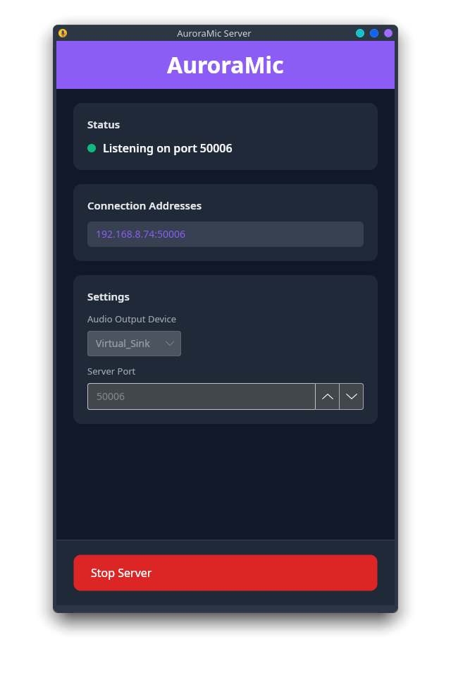
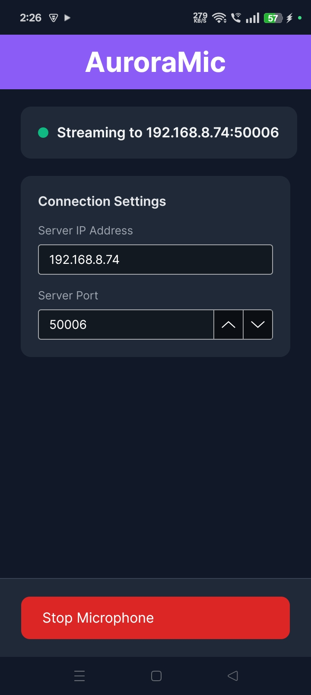

# AuroraMic

Use your Android phone as a wireless microphone on your Desktop.

## Screenshots




## How it works

The Android app captures audio from the microphone and streams it over UDP to the desktop server, which plays it back through any output device on the PC. A handshake ensures the server is ready before streaming begins.

```
[Android mic] ──UDP──▶ [Desktop server] ──▶ [speakers / headphones / virtual cable]
```

## Projects

| Project | Target | Description |
|---|---|---|
| `AuroraMic.Client` | `net10.0` | Shared client logic (audio capture + UDP streaming) |
| `AuroraMic.Client.Android` | `net10.0-android` | Android UI + foreground service |
| `AuroraMic.Server` | `net10.0` | Shared server logic (UDP receiver + audio playback) |
| `AuroraMic.Server.Desktop` | `net10.0` | Desktop entry point (Windows + Linux) |

## Requirements

**Server (Windows / Linux)**
- .NET 10 SDK
- A working audio output device

**Client (Android)**
- Android API 35+
- .NET 10 SDK with Android workload
- Android SDK (set path in `.fsproj` if different from default)
- Java 17

Both devices must be on the same local network.

## Build

**Server**
```bash
dotnet publish AuroraMic.Server.Desktop/AuroraMic.Server.Desktop.fsproj -c Release
```

Output: single self-contained executable in `bin/Release/net10.0/publish/`.

**Android APK**
```bash
dotnet build AuroraMic.Client.Android/AuroraMic.Client.Android.fsproj -c Release
```


## Usage

1. Run `AuroraMic` on the PC (Windows or Linux).
2. Select the audio output device and port, then click **Start Server**.
3. Note the IP address shown in the app.
4. Open AuroraMic on Android, enter the server IP and port, tap **Start Microphone**.

## Configuration

The server saves settings to `settings.json` next to the executable:

```json
{
  "Port": 50006,
  "OutputDevice": "Speakers (Realtek Audio)"
}
```

Default port: `50006`. Valid range: `1024–65535`.

## Android permissions

The app requests the following at runtime:

| Permission | Reason |
|---|---|
| `RECORD_AUDIO` | Microphone capture |
| `POST_NOTIFICATIONS` | Foreground service notification (Android 13+) |

`INTERNET`, `FOREGROUND_SERVICE`, and `FOREGROUND_SERVICE_MICROPHONE` are declared in the manifest.

## Stack

- **F#** / **.NET 10**
- **Avalonia 11** + **Avalonia.FuncUI** — UI (desktop + Android)
- **SoundFlow 1.4** — audio capture and playback via MiniAudio backend
- **SoundFlow.Extensions.WebRtc.Apm** — AGC/noise suppressor control


## Tips

- Use a virtual audio cable as the output device on the server to route the mic into any app (DAW, OBS, Discord, etc.). On Windows: VB-Cable. On Linux: a PulseAudio/PipeWire null sink.
- The foreground service keeps streaming alive when the Android app is in the background.
